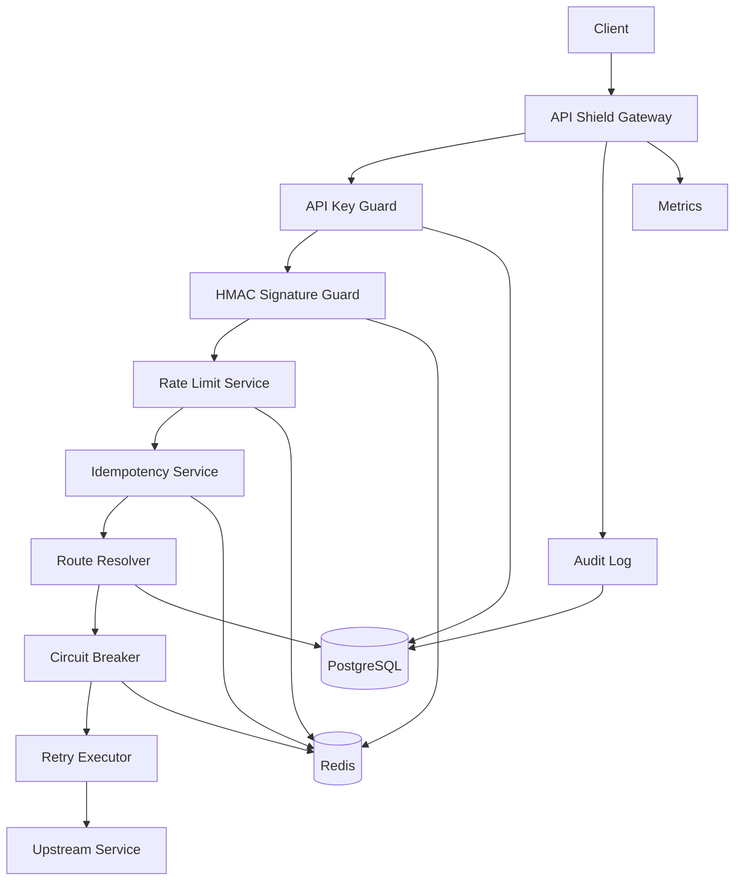

# API Shield

**API Shield** is a backend API Gateway focused on rate limiting, abuse protection, request safety, upstream resilience, and observability.

The project demonstrates backend engineering patterns that are commonly used in production systems: distributed rate limiting, idempotency, HMAC request signing, circuit breakers, retries, audit logging, and Prometheus metrics.

This is not a CRUD application. The main value of the project is request processing, consistency, fault tolerance, and protection of downstream services.

---

## Problem

Modern backend systems often expose APIs to external clients, internal services, partners, or third-party integrations. Without a protection layer, downstream services can suffer from:

* excessive traffic;
* abusive clients;
* duplicated POST requests;
* replay attacks;
* unstable upstream dependencies;
* missing observability;
* unsafe retries;
* lack of request-level auditability.

**API Shield** solves this by acting as a gateway between clients and upstream services.

```text
Client -> API Shield -> Upstream Service
```

The gateway decides whether a request should be allowed, blocked, retried, rejected, cached by idempotency key, or short-circuited because the upstream service is unhealthy.

---

## Core Features

* API key-based tenant identification
* Per-tenant and per-route policies
* Distributed rate limiting with Redis
* Fixed Window rate limiting
* Sliding Window rate limiting
* Token Bucket rate limiting
* HMAC request signature verification
* Replay attack protection with timestamp and nonce validation
* Idempotency-Key support for unsafe HTTP methods
* Circuit breaker for unstable upstream services
* Retry policy with timeout handling
* Safe retry rules for GET/POST requests
* Request audit logs
* Prometheus metrics endpoint
* Health and readiness checks
* Mock upstream services for local testing
* Integration tests
* Load testing with k6

---

## Architecture



## Summary

API Shield demonstrates production-oriented backend engineering patterns:

* distributed rate limiting;
* Redis atomic operations;
* idempotent request handling;
* HMAC request signing;
* replay attack protection;
* circuit breaker;
* safe retries;
* audit logging;
* Prometheus metrics;
* integration and load testing.

The project is designed to show backend skills beyond CRUD APIs and can be discussed in depth during technical interviews.
